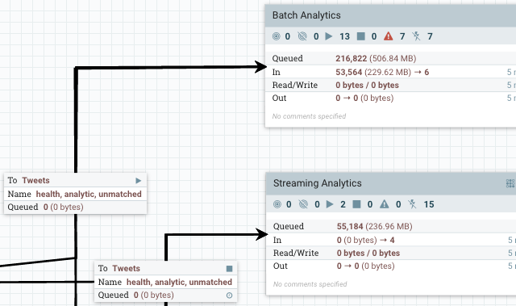

# apache/nifi CI/CD pipeline

Deploy apache/nifi server with CI/CD on Elestio

 
 

# Once deployed ...

You can open apache/nifi UI here:

    URL: https://[CI_CD_DOMAIN]/nifi
    login: root
    password: [ADMIN_PASSWORD]
